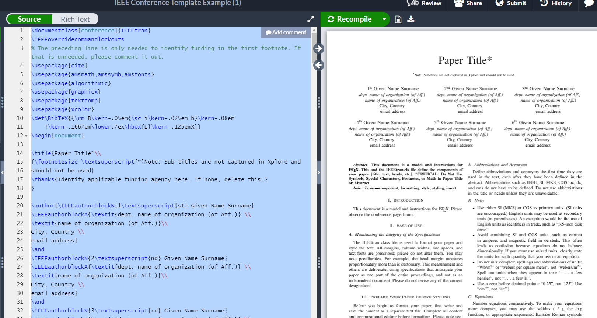
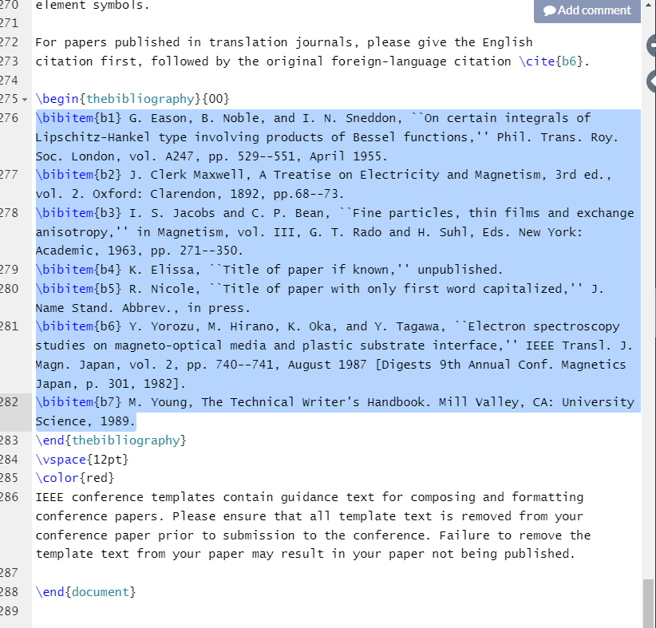

## Reorder Reference


### Step1. 
Copy your .tex content to a.txt
```
example: open your overleaf project, Ctrl+A and than Ctrl+C ---> open your a.txt Ctrl+A and than Ctrl+V.
```

  
### Step2. 
Copy only reference to b.txt
```
```


### Step3. run reorder.py
```
python reorder.py
```

### Step4. copy a_change.txt back to .tex file
```
```